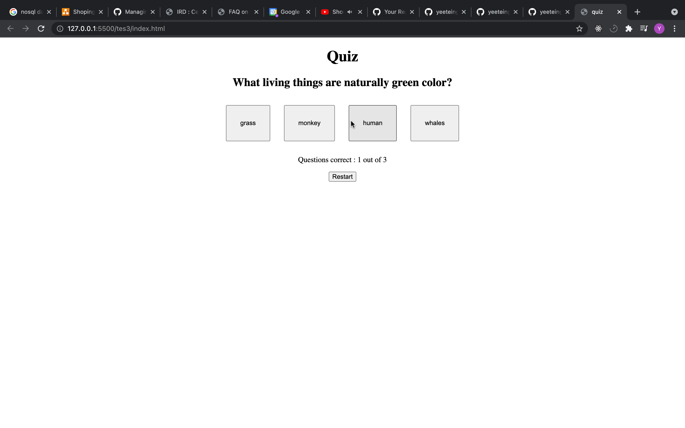

# Multiple Choice Quiz Website
A simple multiple choice quiz website develop by html and javaScript.

## Requirements
- [Python 3](https://www.python.org/downloads/)

## Steps to run website
1. Open your terminal 
2. navigate to `Multiple_Choice_Quiz` folder 
3. run `python3 -m http.server 8000` (Note: make sure nothing run on 8000 port)
4. go to your browser and head to `http://localhost:8000`

## Demo
